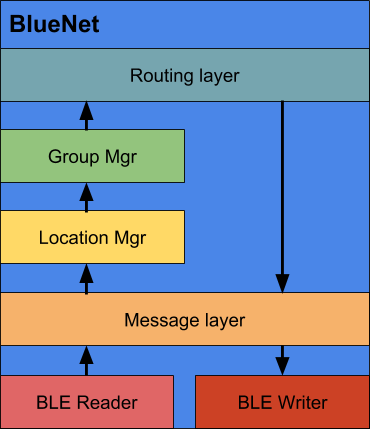

<p align="center">

</p>
<!--  -->


[Introducing BlueNet](#intro)

[Architecture](#archi)

[Stack Protocol](#stack)

- [Overview](#overview)
- [Functions](#function)
- [Messages](#msg_type)
- [Discovery](#discovery)
- [Link Maintenance](#link)
- [Sending](#send)
- [Receiving](#receive)
- [Location Sharing](#location)
- [Addressing](#addressing)

[Android/Java App Development](#andr)

[Reference](#ref)


## Introducing BlueNet <a name="intro"></a>

BlueNet is the stack protocol designed and implemented on top of Bluetooth&reg Low Energy (BLE) stack. While BLE was originally designed as a single-hop networking solution, its widespread use can help fuel adoption of BLE as basis for ad-hoc established networks. However, BLE is not readily able to form such networks and, therefore, BlueNet will provide the mechanisms and protocol enhancements needed to turn a BLE-equipped smartphone into an ad-hoc network capable device.

**Developing Environment**

The current version of BlueNet is developed using java, targeting for Android applications (API level 23 and higher). 

**Core Technology**

BlueNet solely relies on the BLE technology to provide infrastructure-less communications. Connections are established based on BLE Generic Attribute Profiles (GATT), and data is transmitted in the form of GATT characteristics encapsulated by GATT services. Please see [Bluetooth core specifications][2] for more details.


## Architecture <a name="archi"></a>

The architecture of the BlueNet stack is shown as below.

<p align="center">

</p>


## Stack Protocol <a name="stack"></a>

**0.0 Overview** <a name="overview"></a>

This section describes the protocol built on top of BLE to construct a mesh network. The mesh network is meant to operate in an opportunistic fashion with highly mobile nodes. Moreover, this addition to the network stack will be implemented in Android in application space.

**1.0 Functions of the Network Stack** <a name="function"></a>

- Device discovery
- Link maintenance
- Addressing
- Send Message
- Receive Message
- Message routing

**1.1 Message Types and Advertisement Structure** <a name="msg_types"></a>

The advertisement packet is structured thusly:
```
=============================================================
| src_id | dest_id | msg_id | TTL | HP  | U/A | len | <msg> |
-------------------------------------------------------------
| 4 B    | 4 B     | 1 B    | 3b  | 1b  | 4b  | 1B  | 0-9 B |
=============================================================
```

`src_id` and `dest_id` are 'unique' 4 byte alphanumeric strings called BlueNet IDs. The same type of ID is used for groups.

`msg_id` is a single byte that is incremented by a sender for each message sent (including all control messages).

`TTL` is a 3 bit number that represents the number of hops that the message can still be forwarded.

`HP` is the high priority bit used to designate more important messages.

`U/A` is a nybble of unassigned bits

`len` is the length of the <msg> field

`<msg>` contains the relevant information for the given message type, if anything

The message type will be reflected in the GATT service UUID field. The types are as follows:

 - `0x186A - small_msg`: The entire message fits within the 20 byte packet boundary packet so no connection is necessary
    - <msg> is up to 9 bytes of an application message
 - `0x1869 - regular_msg`: The entire message (including header) is longer than 20 bytes. The payload will either be in the <msg> field or in a separate characteristic to be read later
    - <msg> is the message or empty 
 - `0x1868 - location_update`: The device with `src_id` is advertising its location as two adjacent floats
    - <msg> is two floats for the coordinates and two bytes for the group table checksum (0 if not available or empty): | latitude (4 bytes) | longitude (4 bytes) | chksum (2 bytes)
 - `0x186B - group_update`: A device is providing its group table
    - <msg> is the group table (<group_id> <group_type> <group props> <group_id> ...)
 - `0x186C - group_query`:  Query a device for its group table (response is group update)
    - <msg> is the timestamp

**1.2 Device Discovery** <a name="discovery"></a>

All devices scan and advertise at the same time; i.e., perform both the role of Central and Peripheral at the same. It has been shown in [1] that long scan intervals and short advertisement intervals can increase the discovery probability (advertisements and scan intervals coincide) and therefore decrease the discovery latency.

**1.2a Device Discovery--Server**

A GATT server on the devices advertises the BlueNet service through BLE advertisements without any payload. The service contains a characteristic for each message type as well as a pull characteristic. The message type specific characteristics are used to notify other devices about a new message that is available to be read from the pull characteristic of the type indicated by the characteristic. After a client connects they will need to register with the server for these notifications.

- **1.2a.1 Data Structures**

    - Table of registered devices

**1.2b Device Discovery--Client**

A GATT client on the devices scans for advertisements for the BlueNet service and connects to the GATT server if not already connected. The client will register for notifications for each of the message type characteristics.

- **1.2a.1 Data Structures**

    - Table of device connections: used for managing the GATT connection with each server
    - Table of Bluetooth and BlueNet addresses: helps with tracking topology information and directing communication

**1.3 Link Maintenance** <a name="link"></a>

Since GATT connections will disconnect when the connection becomes stale (no data transferred between two devices for 20 seconds on Android), location updates are sent frequently enough to prevent disconnections due to timeouts.

**1.4 Send Message** <a name="send"></a>

Except for Small Messages, all message types have their header bytes and payload bytes place into separate characteristics. The header goes into the characteristic corresponding to that message's type, and the payload goes into a Pull characteristic. If a particular one-hop neighbor is indicated by upper layers of the network stack, then only that neighbor receives the notification for the changed (header) characteristic; otherwise, all neighbors are notified of the change. Once a receiving device decides it wants the message, it will read the data out of the Pull characteristic. If _t_ milliseconds have elapsed without any read attempts, then a new message can be sent (and can replace the contents of the Pull characteristic). 

With Small Messages, the entire payload fits within the 20 bytes allotted to a BLE packet (without renegotiating the MTU), thus the payload is sent along with the header in the notification.

All outgoing messages receive a message ID which is a single byte number to identify the message. 

- **1.4.1 Data Structures**
    - Outgoing message queue: contains all messages to be sent

**1.5 Receive Message** <a name="receive"></a>

When a GATT client receives a notification, the contents of the characteristic are parsed into a packet object. The characteristic UUID is used to set the message type, and the one-hop neighbor can be determined from the Bluetooth to BlueNet address table. Messages are checked to see if they are relatively unique (based on the source ID and the message ID) and passed on to other layers of the network stack which manage locations, groups, and routing.

When the payload is sent along with the notification then no further work is needed. However, when there is no
payload, and the message length is greater than zero, a method to read from the Pull characteristic (should the data be desired by this device) is passed along with the packet object.

- **1.5.1 Data Structures**
    - Buffer of recent messages: Tracks (src_id, msg_id) pairs that can be used to identify repeated messages. Only need to track a finite number of entries.


**1.6 Location Dissemination** <a name="location"></a>

There are a number of different approaches to disseminating location information throughout the network beyond flooding. Here are some of the following options inspired by current literature:

Location updates are sent or forwarded based on the error estimate where the error is driven by:

- the elapsed time since the last location update
- the historical changes in the node's location

Location updates are sent or forwarded based on the distance that a node has traveled from its previous location. This can be combined with the error estimation.

Location updates are sent or forwarded based on the velocity of the node.

The above can be combined with hop or distance thresholds to decrease the frequency at which more distant nodes get updated about a particular node's location.

The implementation that we will be following is:

- Establish four zones (me, near, medium, far) based on radius from the current node each with their own difference threshold (D).
    - me: 0 hops
    - near: 1 hop
    - medium: 2 hops
    - far: >3 hops
- A node tracks the last five locations for each node it has heard from (including itself).
- The decision on whether to (re)broadcast is based on the root mean squared (RMS) / mean squared distance of the last five location readings (as a way to capture the tendency of GPS measurements to wobble near a particular location if standing still and what a deviation from this should look like). If no recent locations are available then the difference between the current location and the last location are used (with an initialized location of (0,0) which could be problematic if we are operating in the Gulf of Guinea)
- The following thresholds will be used for determining when to (re)broadcast, but require further evaluation:
     - zone 'me' (the current node): D > 1m
     - zone 'near': D > 3m
     - zone 'medium': D > 7m
     - zone 'far': D > 13m
- Currently, an error is added to the RMS/ mean squared distance calculation such that .5m is added each second past the most recently shared location update.
- Due to the limitation of GATT packets to 20 bytes, the latitude and longitude are both floats rather than doubles.

**1.7 Message Dissemination / Routing** <a name="routing"></a>
Messages are currently flooded in the network with only the message uniqueness test and TTL to contain the flood.

**1.8 Addressing** <a name="addressing"></a>

- All nodes and groups have a unique 4 byte id
- Note: Groups have not been thoroughly tested
- A group is a set of nodes (possibly empty), identified by a unique id that is either a Named Group or Geographic Group
    - A *Named Group* is simply a labelling mechanism to which a device can subscribe (a device could be part of group 'Blue' for instance)
    - A *Geographic Group* is a group that is associated with a circle (specified in meters) around a pair of coordinates.
- A node can belong to any number of groups
- Groups can be addressed just like a node
    - forwarding to a group only differs in that a message is forwarded as long as TTL > 0 rather than ending when an appropriate recipient is found.
- Groups are created by anyone
- Lists of available groups can be shared and be queried for.
- Geographic groups are entered and exited automatically (as long as the group is known to the node, of course).
- There is always a special Broadcast or All group that contains all nodes running BlueNet (ID = 0000)

- Named groups allow nodes in a network to be associated and addressed concisely no matter their location. This does, however, create an issue for a routing mechanism based on geography. 

- A 16-bit checksum for the table of group IDs is added to the location updates to help disseminate the set of groups.


## Android/Java App Development <a name="andr"></a>

[TO BE FILLED SOON!]

## Reference <a name="ref"></a>


    [1]: Cho, Keuchul, Woojin Park, Moonki Hong, Gisu Park, Wooseong Cho, Jihoon Seo, and Kijun Han. 2014. “Analysis of Latency Performance of Bluetooth Low Energy (BLE) Networks.” Sensors (Basel, Switzerland) 15 (1): 59–78. https://doi.org/10.3390/s150100059.
    [2]: https://stackoverflow.com/questions/37151579/schemes-for-streaming-data-with-ble-gatt-characteristics
    [3]: https://devzone.nordicsemi.com/f/nordic-q-a/47/writing-more-than-20-bytes-at-a-time-to-a-characteristic?ReplyFilter=Answers&ReplySortBy=Answers&ReplySortOrder=Descending
    [4]: https://stackoverflow.com/questions/24135682/android-sending-data-20-bytes-by-ble
    [5]: https://stackoverflow.com/questions/38640908/android-ble-how-is-large-characteristic-value-read-in-chunks-using-an-offset
    [6]: https://stackoverflow.com/questions/31030718/handling-indications-instead-of-notifications-in-android-ble


  [1]: https://stackoverflow.com/questions/34346589/android-ble-advertising-interval-change
  [2]: https://www.bluetooth.com/specifications/bluetooth-core-specification